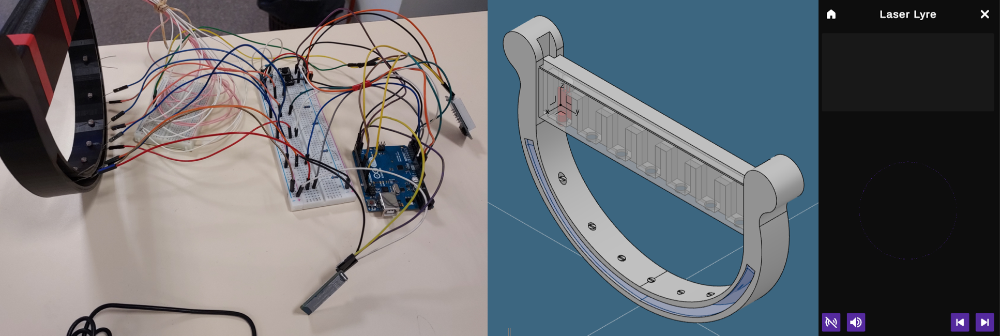
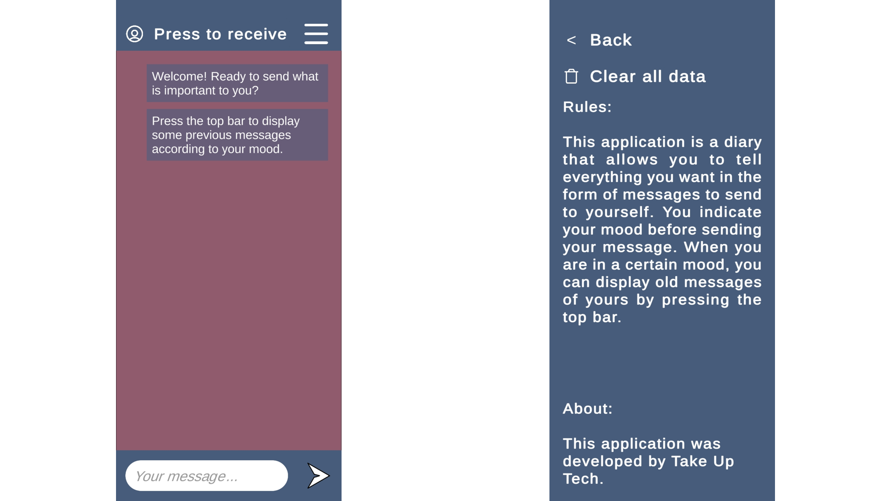
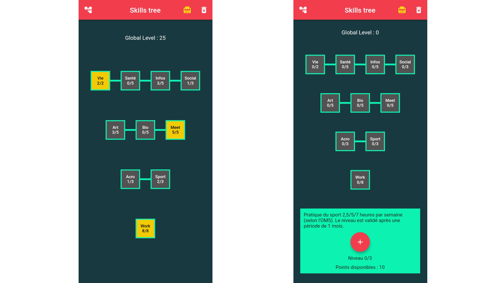

# Small Projects

## Laser Lyre - October 2023
> **Challenge**: Create a connected, digital musical instrument.

Discover the Laser Lyre, a project merging music and technology. Your smartphone transforms into a speaker, while the app lets you visualize the music spectrum, and control the sound of notes.

The design of the Laser Lyre was created using CAD software and then, 3D printed. The lyre is connected to a smartphone via an Arduino Bluetooth module. The traditional strings of the lyre have been replaced by lasers. This not only adds a modern touch to the instrument but also enhances the musical experience by providing a unique way to play the instrument.

`New update - October 2023:`

- Change the sounds of the notes using the application, as well as the lyre ;
- Play example songs using the application.

  

> #Unity, #IoT (Arduino), #CAD

## Message for Myself - November 2022
> **Challenge**: Development of a mobile mood monitoring application.

Message for Myself is a diary in the form of a messaging application. You can send messages and choose the mood of this message. Once sent, your messages are saved. 
Each time you open the application again the conversation field is reset. Nevertheless, if one day you want to remember events or feelings from your past, you can ask (by pressing a button) to receive a old message from yourself by choosing again the mood of the message.

The application is developed on Unity 3D for smartphone. It is also developed on python in a more advanced version, using `Kivy`, `matplotlib` and `google firebase api`, so you can:
- Receive messages from anyone ;
- You can also track your daily mood using a graph.

  

> #Unity, #Python, #Kivy, #Matplotlib, #Firebase API

## Web Images Downloader - July 2022
> **Challenge**: Read manga offline instead of using scans from a web site?

The 'WebImagesDownloader' project allows you to download all the images of a website with distinct characteristics.

### Search and download images:
- Download an image with its link,
- Download an image with its link and check that it is not corrupted,
- Download all the images from a web page by searching in the HTML page url links associated with the 'img' tags.

### Post processing:
- Checks for corrupted images from all images downloaded,
- Converts downloaded images into a .pdf file.

The software tries to automate as much as possible the downloading of images. When the images are on different web pages, it can :
- Use a pattern (given by the user) that repeats in the url links of those images,
- Download images from links of web pages found from a main web page.

However, as each web site is coded differently, it is very difficult to find a universal pattern, that's why the program works according to very specific patterns. The user will have to add a new function dealing with a new pattern if it comes from a web site whose pattern has not been processed.

> #Python, #Web scraping

## Laplacian Edge Detection - January 2022

> **Challenge**: Part of a school project, use the Laplacian formula in Matlab.

Part of a school project, in a group of 4, we decided to use the Laplacian formula to make an edge detection script. It allowed to read an image, apply some filters on it and the Laplacian on each pixel to return only edges of this image. Then, we also conducted an analysis of the script execution time regarding to image sizes. All details are in the report (in French) in the corresponding folder of this repository. An example of our script result is displayed below:

  

> #Matlab, #Laplacian, #Edge detection

## Skill Tree - June 2021
> **Challenge**: Development of an Android application using Flutter and Dart.

### Context:
Welcome to Skill Tree, an engaging Android application developed using Flutter and Dart. This project served as a comprehensive learning experience, delving into the nuances of coding in Flutter/Dart, a unique programming language designed for mobile applications. Through this endeavor, I not only grasped the syntax of this language, known for its distinct approach, but also honed my skills in managing user data storage.

### Gameplay:
Skill Tree is not just an app, it's a motivational tool that inspires users to cultivate new habits across various aspects of their lives, all wrapped in an interactive gaming experience.

### Features:
Here are some key highlights of the app's features:

- **Mission Fulfillment**: Complete daily missions and track your progress through the acquisition of new skills.
- **Friendly Competition**: Climb up and challenge your friends.
- **Intuitive Interface**: Enjoy a simple and user-friendly interface that maximizes your time for activities.

  

Download [link](https://github.com/CyberTorii/Projects/releases/tag/V.1.01.06.21)

**Embark on a Journey of Self-Improvement with Skill Tree!**

> #Flutter, #Dart, #Real-life skill tree
